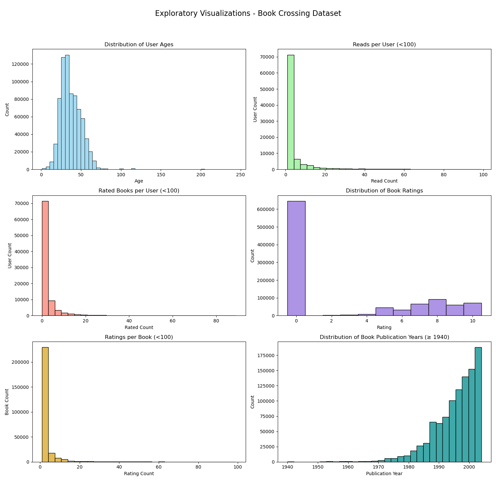
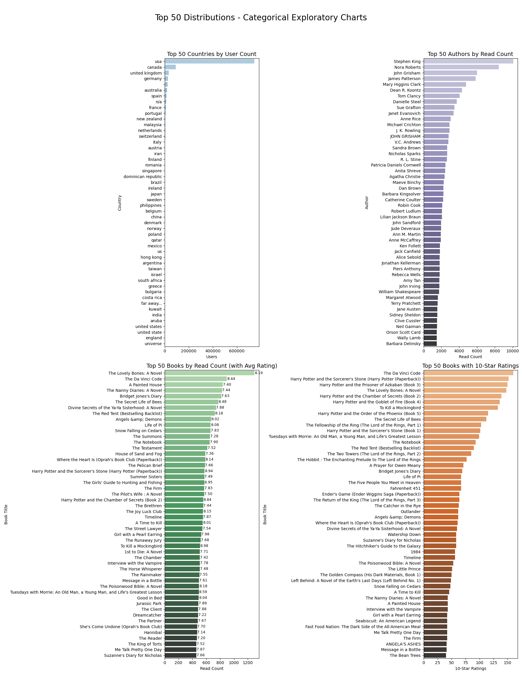
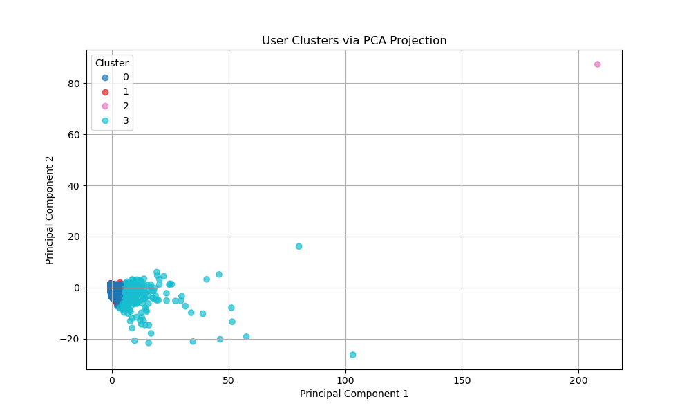

# UCB_AI-ML_20.1_Capstone_Initial_Report_EDA

**Author** Debra Fant
---
This repository contains:
- **book_clustering_EDA.ipynb**: Jupyter Notebook containing exploratory data analysis, feature engineering, model comparison, and tuning.
- **data/**: Folder containing the datasets used in this project. 
- **images/**: Folder with generated plots and visualizations.
---
## 🧠 Executive Summary
This project investigates how user behavior around book ratings can be used to uncover distinct groups of readers using unsupervised learning. The focus is on clustering users into interpretable segments to enable more personalized book recommendations and strategic content targeting.

## 🎯 Rationale
**Why this matters**: Understanding user behavior is critical for strategic decision-making in digital content platforms. By clustering users with interpretable, behavior-based features, this project can uncover actionable insights. These segments can guide product development, content strategy, and marketing priorities—enabling more focused investments and personalized user experiences. Without this analysis, platforms risk missing key engagement drivers and allocating resources toward generic strategies that may not resonate.

## ❓ Research Question
Can we cluster users based on interpretable features extracted from their book rating behavior to uncover distinct reader segments?

**Hypothesis**: It is possible to uncover meaningful and interpretable user segments by clustering users based on book rating behavior and available profile information. These segments can reveal distinct patterns in engagement, preferences, and interest, supporting more targeted content, product, and marketing strategies.

## 💾 Data Sources 
The dataset is sourced from Kaggle: [Book Crossing Dataset](https://www.kaggle.com/datasets/syedjaferk/book-crossing-dataset?select=BX-Book-Ratings.csv). Collected by Cai-Nicolas Ziegler in a 4-week crawl (August / September 2004) from the Book-Crossing community with kind permission from Ron Hornbaker, CTO of Humankind Systems. Contains 278,858 users (anonymized but with demographic information) providing 1,149,780 ratings (explicit / implicit) about 271,379 books. It contains:

● BX-Users- Contains the users. Note that user IDs (User-ID) have been anonymized and map to integers. Age and location is provided if available.

● BX-Books - Identified by their respective ISBN. Book metadata, such as Book-Title, Book-Author, Year-Of-Publication, Publisher, were obtained from Amazon Web Services. 

● BX-Book-Ratings - Contains the book rating information (User-ID, ISBN, Rating).

Additionally, I am using data from [Simple Maps, US Cities Data](https://https://simplemaps.com/data/us-cities) to get lat and lng for US cities.  Manual google search for high volume cities not included in the Simple Maps data to create [loc_lat_lng.csv]("data/loc_lat_lng.csv")

---
### Methodology
The project follows a streamlined version of CRISP-DM for unsupervised learning:

**1. Business Understanding**  
Develop reader segments that reflect different behaviors and engagement patterns using clustering techniques. The outcome will support personalization and strategic content decisions, particularly in environments with limited demographic data.

**2. Data Understanding**  
Integrate the 3 data files and explore and assess the structure, completeness, and behavioral richness of the Book-Crossing dataset. This includes rating patterns, book metadata (titles, authors, publishers, year), and user demographics. 

**3. Data Preparation**  
- Clean and structure the raw dataset
- Parse and standardize book metadata (author, publisher, pub year)
- Parse location into city, region, country (when available)
- Apply TF-IDF to title words (lemmatized book titles excluding stop words) with N-grams = 1,2
- Engineer user-level features (examples below):
  - Reading and rating counts and derivative features
  - Publication era preferences
  - Title-word extraction:
    - `interest_title_words` (all books)
    - `fav_title_words` (books rated > 7)
  - Favorite author/publisher (mode or frequency)
- Optionally split the dataset (e.g., 80/20) to reserve a portion for future prediction experiments.

**4. Modeling**  
- Use clustering techniques (ie KMeans) to cluster users based on behavioral and demographic features
- Apply dimensionality reduction (PCA) for visualization only
- Evaluate interpretability and separation of clusters

**5. Evaluation**  
- Silhouette Score to guide K choice
- Distribution analysis of users across clusters
- Interpretability based on key features per segment

**6. Deployment / Insights**  
- Assign persona labels to users
- Investigate implications for:
  - Personalized book recommendations
  - Thematic or genre-based content promotions
  - Identifying underserved reader personas

**7. Tools**
- **Data Wrangling**: `pandas`, `numpy`, `os`, `zipfile`  
- **Visualization**: `matplotlib.pyplot`, `seaborn`  
- **Text Processing**: `re`, `collections.Counter`, `nltk` (`stopwords`, `WordNetLemmatizer`)  
- **Modeling & Feature Engineering (scikit-learn)**:  
  - Preprocessing: `StandardScaler`, `OneHotEncoder`, `TfidfVectorizer`  
  - Workflow: `Pipeline`, `ColumnTransformer`, `train_test_split`  
  - Clustering & Evaluation: `KMeans`, `PCA`, `silhouette_score`

---

## 🧭 Results/Learnings
- **📊 Exploratory Data Analysis (EDA)**
  - While the dataset included a wide age range of users, most users fell into a small band, ages 25-40.  In the baseline cluster analysis, the mean age of each cluster only varied about 2.5 years.
  - A significant portion of user interactions in the dataset lack explicit feedback — 63% of ratings are zero (647k/1031k), indicating implicit interactions or unrated activity. This means that fewer than half of all book interactions result in a true rating (1–10).
  - Since the vast majority of readers are from the US, I focused the analysis on U.S. users. This also allowed me to utilize latitude and longitude for US cities for meaningful location-based clustering.
  - Interestingly, the most read book was "Wild Animus" by Rich Shapero despite the fact that it had mediocre rating of 4.4/10.  This book has an interesting [backstory](https://litreactor.com/columns/what-the-hell-is-wild-animus).  I may want to exclude these records in the future.
  
  

- **🎯 Cluster Analysis Baseline K-Means Model**
  - The sillouette score of the baseline model is .403 with k=3.  This is a decent score but >88% of users are in a single cluster.
  - At k=4, the sillouette score drops to .144 indicating limited separation.  The largest cluster contains 66% of users.
  - The PCA projection (for k=4) confirms that most user clusters are relatively close together, with limited visual separation. This suggests that the clusters may capture subtle variations in user behavior rather than strongly distinct personas. 
 

### 🧠 Cluster Summary & Personas

| Cluster | % of Users | Avg Age | Read Count | Rated High Count | Avg Rating | Author Diversity | Publisher Diversity | Favorite Era | Favorite Author | Most Read Book     | Persona Name        |
|--------:|------------|--------:|------------|------------------:|------------:|------------------:|---------------------:|--------------|-----------------|----------------------|---------------------|
| 1       | 66.0%      | 38.04   | 4.98       | 1.64              | 7.78        | 0.98             | 0.96                | 2000s        | Dan Brown       | A Painted House     | 📚 **Casual Browsers** |
| 3       | 24.0%      | 36.80   | 1.81       | 0.00              | 3.28        | 0.99             | 0.99                | 2000s        | Rich Shapero    | Wild Animus         | 🌱 **Disconnected Dabblers** |
| 0       | 9.7%       | 36.31   | 100.95     | 20.82             | 7.79        | 0.70             | 0.54                | 1990s        | Stephen King    | 1st to Die: A Novel | 🔍 **Engaged Explorers** |
| 2       | 0.3%       | 39.09   | 1621.58    | 165.51            | 7.97        | 0.65             | 0.23                | 1990s        | Nora Roberts    | 1984                | 📖 **Super Readers** |

---

### ✍️ Persona Descriptions (in order of prevelance)

- **📚 Casual Browsers (Cluster 1)**  
  The largest group, representing two-thirds of users. They read infrequently but have relatively high author diversity, suggesting wide but shallow exploration. Their preferences include mainstream authors like Dan Brown and books from the 2000s.
  - **Theme**: *Book Club Readers & Escapists*  
     - **Interest Words**: life, mystery, guide, love, time, classic, club  
     - **Favorite Words**: life, club, mystery, time, love, woman  
  - **Profile**: Light but curious readers leaning toward popular, accessible books often found in book clubs or lifestyle picks.
  

- **🌱 Disconnected Dabblers (Cluster 3)**  
  Lightest engagement group with the lowest read and rating counts. Average ratings are low (3.28), possibly due to confusion, ambivalence, or non-engagement. Their most read book is the niche "Wild Animus" by Rich Shapero which purportedly was a Book Crossing give-a-way.
  - **Theme**: *Experimental Samplers*
    - **Interest Words**: mystery, love, romance, woman, guide, story, world  
    - **Favorite Words**: mystery, guide, love, novel, world, time, secret, classic
  - **Profile**: Sporadic readers exploring niche or abstract titles with limited rating engagement or clear preferences.

- **🔍 Engaged Explorers (Cluster 0)**  
  Small but active group, reading around 100 books and rating many with high scores. They explore broadly (moderate diversity) and enjoy 1990s-era books and authors like Stephen King.
  - **Theme**: *Classic Story Seekers*    
    - **Interest Words**: mystery, love, romance, woman, guide, story, world  
    - **Favorite Words**: mystery, guide, love, novel, world, time, secret, classic  
  - **Profile**: Avid readers of narrative-rich fiction, especially mystery and romance. Favor classic, emotionally engaging titles.

- **📖 Super Readers (Cluster 2)**  
  A rare but standout group—only 0.3% of users—who exhibit extreme engagement: reading over 1,600 books and rating more than 160 highly. Their preferences are tightly focused (low diversity), with high affinity for authors like Nora Roberts and iconic titles like *1984*.
  - **Theme**: *Romance Devotees* 
    - **Interest Words**: mystery, love, romance, story, silhouette, book  
    - **Favorite Words**: mystery, guide, classic, love, tale, world, book  
  - **Profile**: Exceptionally high-volume readers with strong affinity for romantic and serialized fiction.

---
---

## ✅ Next Steps
- **Feature Engineering & Filtering Refinement**  
  - Consider eliminating Age as a modeling feature and allow the additional 25+% of records back into the analysis.  Using age_quality as an indicator of engagement (providing age shows higher engagement/trust than not providing age) could be a more distinctive feature for modeling. Age will still be available for persona analysis.
  - Alternatively, consider only using records that included an explicite rating if implicite ratings introduce noise. 
  - Consider eliminating some features that may be redundant (ex: Publisher Diversity).
  - Consider filtering out "Wild Animus" records and eliminating severe outliers.
  - Super Reader - Cluster 2 group averaged 1600 books per reader over 4 weeks which warrants further investigation.
  - Refine the text processing methodology to mine further insight using book titles.  

  
- **Model Exploration**  
  Evaluate alternative clustering algorithms such as DBSCAN to compare with KMeans results.

- **Hyperparameter Tuning**  
  Optimize the number of clusters (`k`) using grid search, test against different feature subsets.

- **Cluster Profiling & Recommendation Development**  
  Add richer profiling of clusters to support clearer persona labels and development of recommendations to various stakeholder groups.

- **Downstream Applications**  
  Explore opportunities to experiment utilizing the holdout data set and new learnings.

